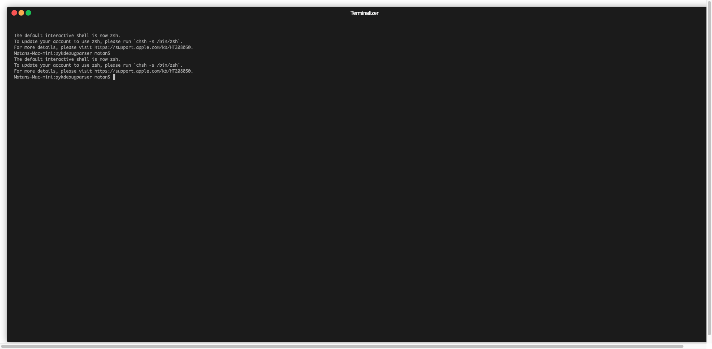

[](https://github.com/matan1008/pykdebugparser/actions/workflows/python-app.yml "Python application action")
[](https://pypi.org/project/pykdebugparser/ "PyPi package")
[](https://lgtm.com/projects/g/matan1008/pykdebugparser/context:python)

- [Description](#description)
- [Installation](#installation)
- [Usage](#usage)
    * [CLI](#cli)
    * [Python](#python)
    * [Example](#example)

# Description

`pykdebugparser` is a utility created in order to parse Darwin's (iOS and OSX) kdebug events.

The main difference between `pykdebugparser` and other utilities like fs_usage and ktrace is the traces parsing and
formatting.

# Installation

Install the last released version using `pip`:

```shell
python3 -m pip install --user -U pykdebugparser
```

Or install the latest version from sources:

```shell
git clone git@github.com:matan1008/pykdebugparser.git
cd pykdebugparser
python3 -m pip install --user -U -e .
```

# Usage

## CLI

`pykdebugparser` command line is intended for parsing kdebug dumps.
You can create a dump using the `ktrace` utility:

```shell
sudo ktrace dump
```

After creating the dump, you can print all kevents:

```shell
pykdebugparser kevents trace001.ktrace
```

The output will be:

```
...
2489180732445653 MACH_vm_page_release (0x130049c)                          DBG_FUNC_NONE  Error: tid 19699133        b'\x05\x00\x00\x00\x00\x00\x00\x00\x00\x00\x00\x00\x00\x00\x00\x00\x00\x00\x00\x00\x00\x00\x00\x00\x00\x00\x00\x00\x00\x00\x00\x00'
2489180732446165 BSC_pread_extended_info (0x40e0264)                       DBG_FUNC_NONE  tccd(123)                  b'\x08\x00\x00\x00\x00\x00\x00\x00\x1c\x00\x00\x00\x00\x00\x00\x00\x00\x00\x00\x00\x00\x00\x00\x00\x00\x80\x04\x00\x00\x00\x00\x00'
2489180732446204 BSC_pread (0x40c0264)                                     DBG_FUNC_END   tccd(123)                  b'\x00\x00\x00\x00\x00\x00\x00\x00\x1c\x00\x00\x00\x00\x00\x00\x00\x00\x00\x00\x00\x00\x00\x00\x00{\x00\x00\x00\x00\x00\x00\x00'
2489180732446671 BSC_pread (0x40c0264)                                     DBG_FUNC_START tccd(123)                  b'\x08\x00\x00\x00\x00\x00\x00\x00\x00\x80\x04\x8b\xb4\x7f\x00\x00\xf0\x11\x00\x00\x00\x00\x00\x00 \x80\x04\x00\x00\x00\x00\x00'
2489180732447336 BSC_pread_extended_info (0x40e0264)                       DBG_FUNC_NONE  tccd(123)                  b'\x08\x00\x00\x00\x00\x00\x00\x00\xf0\x11\x00\x00\x00\x00\x00\x00\x00\x00\x00\x00\x00\x00\x00\x00 \x80\x04\x00\x00\x00\x00\x00'
2489180732447374 BSC_pread (0x40c0264)                                     DBG_FUNC_END   tccd(123)                  b'\x00\x00\x00\x00\x00\x00\x00\x00\xf0\x11\x00\x00\x00\x00\x00\x00\x00\x00\x00\x00\x00\x00\x00\x00{\x00\x00\x00\x00\x00\x00\x00'
2489180732448030 BSC_pread (0x40c0264)                                     DBG_FUNC_START tccd(123)                  b'\x08\x00\x00\x00\x00\x00\x00\x00@&\x86\x08\x00p\x00\x00\x08\x00\x00\x00\x00\x00\x00\x00\xb0\xbd\x08\x00\x00\x00\x00\x00'
2489180732448594 PMAP_flush_TLBS (0x1700020)                               DBG_FUNC_START Error: tid 19699133        b'\x03\x86\xc0\x17+\xe2\xa2\xf9\x00\x00\x00\x00\x00\x00\x00\x00\x00\x00 \x81\xff\x7f\x00\x00\x00\x00@\x81\xff\x7f\x00\x00'
2489180732448594 BSC_pread_extended_info (0x40e0264)                       DBG_FUNC_NONE  tccd(123)                  b'\x08\x00\x00\x00\x00\x00\x00\x00\x08\x00\x00\x00\x00\x00\x00\x00\x00\x00\x00\x00\x00\x00\x00\x00\xb0\xbd\x08\x00\x00\x00\x00\x00'
2489180732448630 BSC_pread (0x40c0264)                                     DBG_FUNC_END   tccd(123)                  b'\x00\x00\x00\x00\x00\x00\x00\x00\x08\x00\x00\x00\x00\x00\x00\x00\x00\x00\x00\x00\x00\x00\x00\x00{\x00\x00\x00\x00\x00\x00\x00'
2489180732449119 PMAP_flush_TLBS (0x1700020)                               DBG_FUNC_END   Error: tid 19699133        b'\x03\x86\xc0\x17+\xe2\xa2\xf9\x00\x00\x00\x00\x00\x00\x00\x00\x00\x00 \x81\xff\x7f\x00\x00\x00\x00@\x81\xff\x7f\x00\x00'
2489180732449181 BSC_pread (0x40c0264)                                     DBG_FUNC_START tccd(123)                  b'\x08\x00\x00\x00\x00\x00\x00\x00\x08\x02\x05\x8b\xb4\x7f\x00\x00\xed-\x00\x00\x00\x00\x00\x00\xb8\xbd\x08\x00\x00\x00\x00\x00'
2489180732451808 BSC_pread_extended_info (0x40e0264)                       DBG_FUNC_NONE  tccd(123)                  b'\x08\x00\x00\x00\x00\x00\x00\x00\xed-\x00\x00\x00\x00\x00\x00\x00\x00\x00\x00\x00\x00\x00\x00\xb8\xbd\x08\x00\x00\x00\x00\x00'
2489180732451850 BSC_pread (0x40c0264)                                     DBG_FUNC_END   tccd(123)                  b'\x00\x00\x00\x00\x00\x00\x00\x00\xed-\x00\x00\x00\x00\x00\x00\x00\x00\x00\x00\x00\x00\x00\x00{\x00\x00\x00\x00\x00\x00\x00'
2489180732462074 BSC_access (0x40c0084)                                    DBG_FUNC_START tccd(123)                  b'\x00B\xf8\x89\xb4\x7f\x00\x00\x00\x00\x00\x00\x00\x00\x00\x00\xed-\x00\x00\x00\x00\x00\x00\xb8\xbd\x08\x00\x00\x00\x00\x00'
2489180732464448 VFS_LOOKUP (0x3010090)                                    DBG_FUNC_START tccd(123)                  b'\x83\xe3\xf3 +\xe2\xa2\xf9/System/Library/CoreServ'
2489180732464483 VFS_LOOKUP (0x3010090)                                    DBG_FUNC_NONE  tccd(123)                  b'ices/WiFiAgent.app/Contents/_Cod'
2489180732464516 VFS_LOOKUP (0x3010090)                                    DBG_FUNC_END   tccd(123)                  b'eSignature\x00\x00\x00\x00\x00\x00\x00\x00\x00\x00\x00\x00\x00\x00\x00\x00\x00\x00\x00\x00\x00\x00'
2489180732464945 BSC_access (0x40c0084)                                    DBG_FUNC_END   tccd(123)                  b'\x00\x00\x00\x00\x00\x00\x00\x00\x00\x00\x00\x00\x00\x00\x00\x00\x00\x00\x00\x00\x00\x00\x00\x00{\x00\x00\x00\x00\x00\x00\x00'
2489180732468969 BSC_open (0x40c0014)                                      DBG_FUNC_START tccd(123)                  b'\x80 \x86\x08\x00p\x00\x00\x00\x00\x00\x00\x00\x00\x00\x00\x00\x00\x00\x00\x00\x00\x00\x00\xb8\xbd\x08\x00\x00\x00\x00\x00'
2489180732472178 VFS_LOOKUP (0x3010090)                                    DBG_FUNC_START tccd(123)                  b'\x83\xe3\xf3 +\xe2\xa2\xf9/System/Library/CoreServ'
2489180732472211 VFS_LOOKUP (0x3010090)                                    DBG_FUNC_NONE  tccd(123)                  b'ices/WiFiAgent.app/Contents/_Cod'
2489180732472245 VFS_LOOKUP (0x3010090)                                    DBG_FUNC_END   tccd(123)                  b'eSignature/CodeRequirements-1\x00\x00\x00'
2489180732472789 BSC_open (0x40c0014)                                      DBG_FUNC_END   tccd(123)                  b'\x02\x00\x00\x00\x00\x00\x00\x00\x00\x00\x00\x00\x00\x00\x00\x00\x00\x00\x00\x00\x00\x00\x00\x00{\x00\x00\x00\x00\x00\x00\x00'
2489180732474796 MACH_vm_page_release (0x130049c)                          DBG_FUNC_NONE  Error: tid 19699133        b'\x14\x00\x00\x00\x00\x00\x00\x00\x00\x00\x00\x00\x00\x00\x00\x00\x00\x00\x00\x00\x00\x00\x00\x00\x00\x00\x00\x00\x00\x00\x00\x00'
2489180732477970 PMAP_flush_TLBS (0x1700020)                               DBG_FUNC_START Error: tid 19699133        b'\x03\x86\xc0\x17+\xe2\xa2\xf9\x00\x00\x00\x00\x00\x00\x00\x00\x00\x00@\x81\xff\x7f\x00\x00\x00\x00`\x81\xff\x7f\x00\x00'
2489180732478444 PMAP_flush_TLBS (0x1700020)                               DBG_FUNC_END   Error: tid 19699133        b'\x03\x86\xc0\x17+\xe2\xa2\xf9\x00\x00\x00\x00\x00\x00\x00\x00\x00\x00@\x81\xff\x7f\x00\x00\x00\x00`\x81\xff\x7f\x00\x00'
2489180732497227 MACH_vm_page_release (0x130049c)                          DBG_FUNC_NONE  Error: tid 19699133        b'\x03\x00\x00\x00\x00\x00\x00\x00\x00\x00\x00\x00\x00\x00\x00\x00\x00\x00\x00\x00\x00\x00\x00\x00\x00\x00\x00\x00\x00\x00\x00\x00'
2489180732498788 PMAP_flush_TLBS (0x1700020)                               DBG_FUNC_START Error: tid 19699133        b'\x03\x86\xc0\x17+\xe2\xa2\xf9\x00\x00\x00\x00\x00\x00\x00\x00\x00\x00`\x81\xff\x7f\x00\x00\x00\x00\x80\x81\xff\x7f\x00\x00'
2489180732499219 PMAP_flush_TLBS (0x1700020)                               DBG_FUNC_END   Error: tid 19699133        b'\x03\x86\xc0\x17+\xe2\xa2\xf9\x00\x00\x00\x00\x00\x00\x00\x00\x00\x00`\x81\xff\x7f\x00\x00\x00\x00\x80\x81\xff\x7f\x00\x00'
2489180732502133 PMAP_flush_TLBS (0x1700020)                               DBG_FUNC_START Error: tid 19699133        b'\x03\x86\xc0\x17+\xe2\xa2\xf9\x00\x00\x00\x00\x00\x00\x00\x00\x00\x00\x80\x81\xff\x7f\x00\x00\x00\x00\xa0\x81\xff\x7f\x00\x00'
2489180732502553 PMAP_flush_TLBS (0x1700020)                               DBG_FUNC_END   Error: tid 19699133        b'\x03\x86\xc0\x17+\xe2\xa2\xf9\x00\x00\x00\x00\x00\x00\x00\x00\x00\x00\x80\x81\xff\x7f\x00\x00\x00\x00\xa0\x81\xff\x7f\x00\x00'
2489180732508415 BSC_madvise (0x40c012c)                                   DBG_FUNC_START tccd(123)                  b'\x00\xa0\x01\x8b\xb4\x7f\x00\x00\x00\x10\x00\x00\x00\x00\x00\x00\x07\x00\x00\x00\x00\x00\x00\x00\xb8\xbd\x08\x00\x00\x00\x00\x00'
2489180732508580 MACH_vm_page_release (0x130049c)                          DBG_FUNC_NONE  Error: tid 19699133        b'\x01\x00\x00\x00\x00\x00\x00\x00\x00\x00\x00\x00\x00\x00\x00\x00\x00\x00\x00\x00\x00\x00\x00\x00\x00\x00\x00\x00\x00\x00\x00\x00'
2489180732509628 PMAP_flush_TLBS (0x1700020)                               DBG_FUNC_START tccd(123)                  b'CO!\x08+\xe2\xa2\xf9\x01\x00\x00\x00\x00\x00\x00\x00\x00\xa0\x01\x8b\xb4\x7f\x00\x00\x00\xb0\x01\x8b\xb4\x7f\x00\x00'
2489180732509750 PMAP_flush_TLBS (0x1700020)                               DBG_FUNC_END   tccd(123)                  b'CO!\x08+\xe2\xa2\xf9\x00\x00\x00\x00\x00\x00\x00\x00\x00\xa0\x01\x8b\xb4\x7f\x00\x00\x00\xb0\x01\x8b\xb4\x7f\x00\x00'
...
```

The main feature of `pykdebugparser` is parsing kevents into meaningful traces.

To use it, just ask for the traces instead of the kevents:
```shell
pykdebugparser traces trace001.ktrace
```

The output will be:
```
...
2489180680661014 WindowServer(124)                 open("/System/Library/CoreServices/WiFiAgent.app/Contents/Info.plist", O_RDONLY), fd: 13
2489180680684484 WindowServer(124)                 fstat64(13)
2489180680688557 WindowServer(124)                 read(13, 0x7fb5fc8ae800, 1927), count: 1927
2489180680690475 WindowServer(124)                 close(13)
2489180680761534 WindowServer(124)                 stat64("/System/Library/CoreServices/WiFiAgent.app/Contents/MacOS/WiFiAgent", 0x7ffee3236880)
2489180680785762 WindowServer(124)                 open_nocancel("/System/Library/CoreServices/WiFiAgent.app/Contents/Resources", O_RDONLY | O_NONBLOCK | O_CLOEXEC), fd: 13
2489180680797695 WindowServer(124)                 fstatfs64(13, 0x7ffee3235ca0)
2489180680799729 WindowServer(124)                 getdirentries64(13, 0x7fb5fcbc1400, 8192, 0x7fb5fe0301d8), count: 1712
2489180680857722 WindowServer(124)                 close_nocancel(13)
...
```

If the dump contains PERF events, you can also request the callstacks:
```
pykdebugparser callstacks trace001.ktrace
```

The output will be:
```
...
15771337734 backboardd(43)
0x00000001be68f404
 0x0000000193145974
  0x0000000193145880
   0x0000000193130b94
    0x0000000193139338
     0x00000001d9bea5a4
      0x0000000193145e08
15771347652 com.apple.dt.instru(326)
0x00000001be68f404
 0x0000000193145974
  0x0000000193145880
   0x0000000193140a44
    0x0000000193139338
     0x00000001d9bea5a4
      0x0000000193145e08
15771352049 DTServiceHub(325)
0x00000001be68f404
 0x000000019314549c
  0x0000000193140504
   0x00000001d9bffc70
    0x0000000102d79a28
     0x0000000102d79960
      0x0000000102d8e0b4
       0x0000000102d798ac
        0x0000000102d8dfcc
         0x0000000102d74c64
          0x0000000102d738e8
           0x0000000102dca280
            0x0000000102dcaf58
             0x00000001947fe2e8
              0x00000001946fb098
               0x00000001948005a0
                0x00000001946fad54
                 0x0000000193185298
                  0x0000000193186280
                   0x000000019312edcc
                    0x000000019312f8a8
                     0x0000000193139338
                      0x00000001d9bea5a4
                       0x0000000193145e08
...
```

Another useful feature is parsing os logs from tracev3 file:
```
pykdebugparser logs trace002.ktrace
```

Will result in:
```
2021-10-21 10:07:18.222638  SpringBoard(65)    [CLSensorFusionService] q.x,<private>,q.y,<private>,q.z,<private>,q.w,<private>,userAccel.x,<private>,userAccel.y,<private>,userAccel.z,<private>,rotationRate.x,<private>,rotationRate.y,<private>,rotationRate.z,<private>,magneticField.x,<private>,magneticField.y,<private>,magneticField.z,<private>,heading,<private>,accuracy,<private>,level,-1,variant,2,mode,0,status,0x110,clientID,0,timestamp,429513.961651,now,429513.961954,latency,0.000303
2021-10-21 10:07:18.222783  kernel(0)          AppleCS35L27Amp::_enableDevice(inEnable=1) [WARNING] PLL is not locked to the selected reference clock. [Interrupt_Register3_Status=0x88888445]
2021-10-21 10:07:18.222788  kernel(0)          AppleCS35L27Amp::_enableDevice(inEnable=1) [WARNING] PLL is not locked to the selected reference clock. [Interrupt_Register3_Status=0x88888445]
2021-10-21 10:07:18.222796  kernel(0)          AppleCS35L27Amp::_updateSpeakerAmpState(inNewAmpState=3) END [mCurrentSpeakerState=3, result=0x0]
2021-10-21 10:07:18.222803  kernel(0)          AppleCS35L27Amp::_updateSpeakerAmpState(inNewAmpState=3) START
2021-10-21 10:07:18.222813  kernel(0)          AppleCS35L27Amp::_updateSpeakerAmpState(inNewAmpState=3) speaker is already in the requested state [mCurrentSpeakerState:3]
2021-10-21 10:07:18.222815  kernel(0)          AppleCS35L27Amp::_updateSpeakerAmpState(inNewAmpState=3) END [mCurrentSpeakerState=3, result=0x0]
2021-10-21 10:07:18.222828  kernel(0)          Speaker: streaming audio
2021-10-21 10:07:18.222951  kernel(0)          _calibrateTimeOffsets: IODMAController000000B4::admac-sio::1832: Clock scaler = 1, Averaged offset = 48 MATU.
2021-10-21 10:07:18.223094  tailspind(469)     Unable to reset existing ktrace: [16: Resource busy]
2021-10-21 10:07:18.223096  tailspind(469)     Unable to enact kdbg state after ktrace bg notification!
2021-10-21 10:07:18.223956  kernel(0)          - Speaker startTransport ret=success(0)
2021-10-21 10:07:18.223969  kernel(0)          - Speaker::startIOEngineGated() ret=success(0)
2021-10-21 10:07:18.224010  mediaserverd(38)    		HALS_IOEngine2::_StartIO(58) on Context 288  state: <private>
2021-10-21 10:07:18.227648  SpringBoard(65)    [CLSensorFusionService] q.x,<private>,q.y,<private>,q.z,<private>,q.w,<private>,userAccel.x,<private>,userAccel.y,<private>,userAccel.z,<private>,rotationRate.x,<private>,rotationRate.y,<private>,rotationRate.z,<private>,magneticField.x,<private>,magneticField.y,<private>,magneticField.z,<private>,heading,<private>,accuracy,<private>,level,-1,variant,2,mode,0,status,0x110,clientID,0,timestamp,429513.966630,now,429513.966963,latency,0.000332
2021-10-21 10:07:18.227951  com.apple.PerformanceTrace.PerformanceTraceService(2076) starting to trace live
2021-10-21 10:07:18.228561  SpringBoard(65)    DisplayLinks Will Fire
2021-10-21 10:07:18.228572  SpringBoard(65)    DisplayLinks Expected Wakeup Time: Proposed Model Time: 10308335227030, Commit Deadline Time: 10308335627030, Expected Wakeup Time: 0, Proposing Ready Time: 10308335227030. Returning: NO
2021-10-21 10:07:18.228576  SpringBoard(65)    Dispatching Display Links. Model Time: 10308335227030 Commit Deadline: 10308335627030, Presentstion Time: 10308336027030
2021-10-21 10:07:18.228767  backboardd(68)     ID is swap ID. __##__signpost.description#____#begin_time#_##_#16199036112369##__## frame_seed=0x9395 refresh_interval=399984 buffer_count=3 __##__signpost.description#____#end_time#_##_#16199037313424##__## prev_frame=16199036912791 skip_request=0
2021-10-21 10:07:18.230319  mediaserverd(38)              AQMEIO_HAL.cpp:1703  aqmeio@0x1078f3a00, device 149 (VirtualAudioDevice_Default), AudioDeviceStart (err 0)
2021-10-21 10:07:18.230673  mediaserverd(38)   Creating service facility connection with <private>
```

Note that each CLI command has some more options, filtering thread ids, limiting the output count and more.

## Python

A more advanced usage can be done by importing the package, for example:

```python
from pykdebugparser.pykdebugparser import PyKdebugParser

parser = PyKdebugParser()
parser.color = True
with open('kdebug.bin', 'rb') as fd:
    for trace in parser.formatted_traces(fd):
        print(trace)
```

## Example





More examples can be found under the [gifs folder](gifs/).
